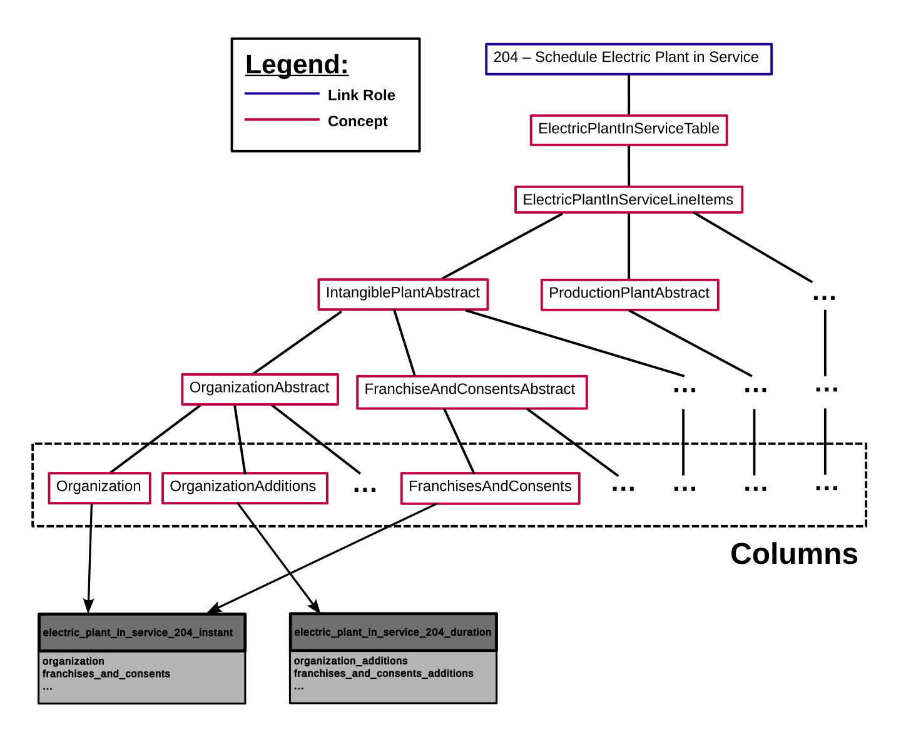

===============================================================================
Parsing
===============================================================================

Taxonomy Parsing
^^^^^^^^^^^^^^^^
`Arelle <https://arelle.org/arelle/>`__ is a popular open source library for working
with XBRL data, and it is used for parsing the taxonomy. Arelle can parse a taxonomy
from either a URL to the taxonomy entry point, or a local path to a zipfile containing
the entire taxonomy.

The extractor will first take a parsed taxonomy and construct a :term:`Taxonomy`
object defined in ``ferc_xbrl_extractor/taxonomy.py``. This is done because the
data structures used by Arelle are not well documented, so it's immediately move to
custom structures. After creating these structures, the extractor will generate
`frictionless datapackage <https://specs.frictionlessdata.io/data-package/>`__, which
contains a schema for the new SQLite DB, as well as useful metadata.

Each table in the SQLite DB is derived from a :term:`Link Role` in the Taxonomy.
This is done by traversing down the Concept tree that is rooted at the Link Role. It
will find all :term:`Concepts <Concept>` which are leaf nodes of this tree. These
leaf nodes are Concepts in the FERC taxonomy that are expected to have
:term:`Facts <Fact>` reported against them, while Concepts higher in the tree
structure exist for defining relationships. The leaf nodes will be sorted by their
:term:`Period` type (either duration or instant), and a table schema will be
generated for each of these Period types. The following diagram demonstrates this
process.

There will also be columns added to these tables that correspond to the
:term:`Context`. For duration tables there will always be a ``start_date``,
``end_date``, and ``entity_id`` column. Instant tables will only have a ``date``,
and ``entity_id`` columns. There will also be columns added for any :term:`Axes <Axis>`
that are defined in the taxonomy. This set of columns created from the Context is
used as the primary key for the table.

Filing Parsing
^^^^^^^^^^^^^^
While Arelle is helpful for parsing taxonomies, it has proven too slow for parsing
large sets of :term:`Filings <Filing>`. So, we've used the
`lxml <https://lxml.de/>`__ library to directly parse filings ourselves. This is not
too difficult as this individual XBRL instances are a fairly simple XML structure
that is easy to parse. These files contain a list of contexts, and a list of facts
that we read into custom data structures.

The first step to parsing a filing is to read all its facts, and save them in a
dictionary that is indexed by the Axes in it's Context. Next, the extractor will
loop through the tables created during the taxonomy parsing, and find which facts
should end up in each table. This is done by looking up the facts with a Axes that
match those in the tables primary key. Each fact that meets this condition, and whose
name matches one of the columns in the table will be added to the table. Rows are
then created by finding all facts with the same primary key.
